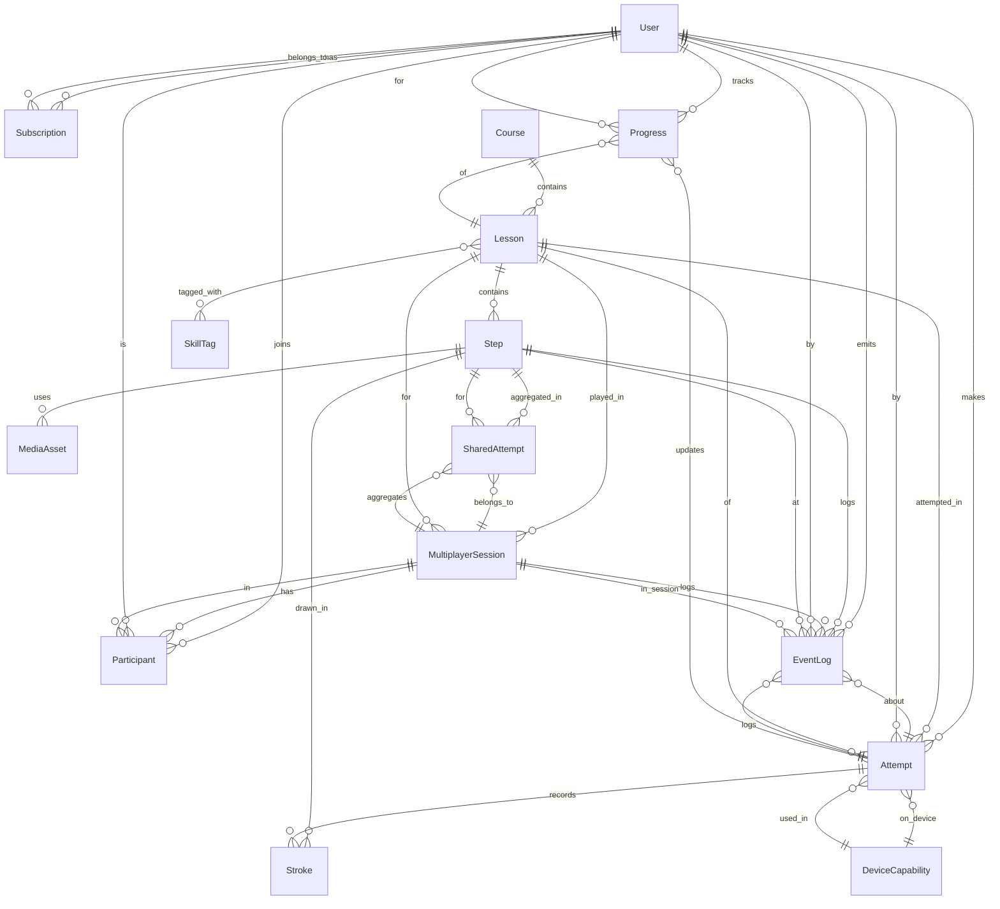

## 1 Minimal Data Model (Based on the Current App)  
Goal: cover lessons, scoring, and real-time multiplayer.

### Key entities & relationships
- `User` —< `Subscription` —< `Progress` —< `Attempt`.
- `Course` —< `Lesson` —< `Step` —< `MediaAsset` (img/svg/video).
- `Lesson` —<> `SkillTag` (many-to-many).
- `Attempt` —< `Stroke` (raw points/pressure) + aggregated `metrics`.
- `DeviceCapability` (stylus/pressure/tilt) —< `Attempt`.
- `MultiplayerSession` —< `Participant` (host/guest, join/leave state) —< `SharedAttempt` (session-level scores/replays).
- `EventLog` (analytics/telemetry per attempt/step: start, finish, undo, retry, hint_shown).

### Entity notes 
- `User`: player account; binds progress and subscription.
- `Subscription`: payment status (plan, period, trial, platform) for VIP access.
- `Course`: themed set of lessons of the same level/topic.
- `Lesson`: a specific lesson with steps; free flag; duration/difficulty.
- `Step`: atomic step with tolerances and scoring weights; links to media/hints.
- `MediaAsset`: visual asset storage (raster/vector/video/animation) with versioning/checksum.
- `SkillTag`: classification of lessons/steps by skills (lines, hatching, calligraphy).
- `Attempt`: lesson attempt; aggregated accuracy/quality metrics, status, device info.
- `Stroke`: raw points/pressure/timing for analysis and replays; can be stored as a blob.
- `Progress`: aggregates per user+lesson (best/last result, attempts count).
- `DeviceCapability`: records device/stylus capabilities (pressure/tilt) for proper scoring.
- `MultiplayerSession`: collaborative drawing session; state (waiting/active/finished), lesson, creator.
- `Participant`: session participant, role (host/guest), join/leave times, final result.
- `SharedAttempt`: aggregated results/replays per step within the session.
- `EventLog`: telemetry of actions (start_step, finish_step, undo, retry, hint) for analytics/debugging.

### Field sketch
- `User`: id, locale, created_at.
- `Subscription`: user_id, plan, status, period_start/end, trial_end, platform.
- `Course`: id, title, level, tags.
- `Lesson`: id, course_id, title, difficulty, est_duration, steps_count, is_free.
- `Step`: id, lesson_id, order, tolerance (px/%), scoring_weights {accuracy, quality}, media_asset_ids, hint_text.
- `MediaAsset`: id, type, uri, checksum, version.
- `Attempt`: id, user_id, lesson_id, started_at, finished_at, score_accuracy, score_quality, status, device_capability_id.
- `Stroke`: attempt_id, step_id, points[], pressure[], duration_ms (could be blob/compressed).
- `Progress`: user_id, lesson_id, best_score, last_score, attempts_count, last_attempt_at.
- `MultiplayerSession`: id, lesson_id, state (waiting/active/finished), created_by, created_at, ended_at.
- `Participant`: session_id, user_id, role, join_at, leave_at, result_score.
- `SharedAttempt`: session_id, step_id, aggregated_score, replay_ref (for playback).
- `EventLog`: user_id, attempt_id, step_id, event_type, ts, payload (JSON).

### Example (JSON sketch)
```json
{
  "user": { 
    "id": "u1", 
    "locale": 
    "en-US" 
  },
  "lesson": {
    "id": "l101",
    "course_id": "c10",
    "title": "Basic Lines",
    "is_free": true,
    "steps": [
      { 
        "id": "s1", 
        "order": 1, 
        "tolerance": 0.12, 
        "scoring_weights": { "acc": 0.6, "qual": 0.4 } 
      }
    ]
  },
  "attempt": {
    "id": "a9001",
    "user_id": "u1",
    "lesson_id": "l101",
    "score_accuracy": 0.82,
    "score_quality": 0.77,
    "status": "finished",
    "device_capability_id": "d45"
  },
  "progress": {
    "user_id": "u1",
    "lesson_id": "l101",
    "best_score": 0.82,
    "attempts_count": 3,
    "last_attempt_at": "2025-12-06T10:00:00Z"
  },
  "multiplayer_session": {
    "id": "m55",
    "lesson_id": "l101",
    "state": "active",
    "participants": [
      { "user_id": "u1", "role": "host", "result_score": 0.8 },
      { "user_id": "u2", "role": "guest", "result_score": 0.78 }
    ],
    "shared_attempts": [
      { "step_id": "s1", "aggregated_score": 0.79, "replay_ref": "replay://m55/s1" }
    ]
  }
}
```

### ERD (mermaid)

[erd](q1_answer_erd.svg)



