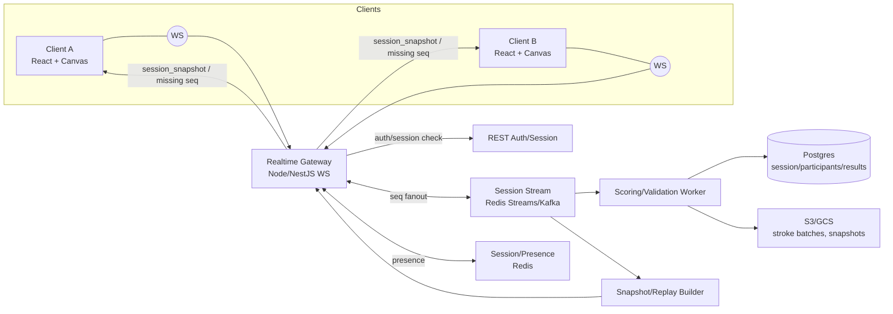

## 2 Real-Time Multiplayer: Architecture

Scenario: one player sees what another draws in real time; lessons are step-based with accuracy/quality scoring and undo support.

### Backend (high level)
- API/Auth: issues session token for WS, checks lesson/subscription access.
- Realtime Gateway (WS, horizontally scalable): accepts client deltas (stroke batches, undo, step change), assigns server `seq`, fans out with backpressure.
- Session/Presence service (Redis): stores session state (participants, current step, last_seq, live cursors).
- State log: per-session stream (Redis Streams or Kafka) for ordering and replay.
- Scoring/Validation worker: on step/batch completion computes accuracy/quality, applies step tolerances.
- Persistence: DB (session/participants/results), object storage for replays (stroke blobs) and snapshots.

### Frontend (React, brief)
- WS client with auto-reconnect, heartbeats; keeps `last_seq`.
- State manager (e.g., Zustand/Redux) + canvas layer; local buffered drawing (batch every ~50–100 ms).
- Optimistic: draw locally immediately; server broadcasts confirmed ops with `seq`.
- Event types: `session_snapshot` (init/late join), `stroke_append`, `undo`, `step_change`, `score_update`, `presence` (cursors/typing-like).

### State sync & ordering
- Each client sends events with `client_op_id`; server assigns monotonically increasing `seq` per session.
- Broadcasting only server `seq` ensures total order; clients apply in `seq` order.
- Typical event shape: `{ session_id, step_id, seq, client_op_id, ts_server, type, payload }`.

### Conflicts and consistency
- Layers/steps: last-writer-wins by `seq`; `undo` is a tombstone by `client_op_id` (idempotent).
- Idempotency: duplicate deliveries with the same `client_op_id` are ignored.
- Throttle stroke deltas (batch + rate limit) to reduce jitter and load.
- Step completion: server validation; only a valid `step_change` advances the session.

### Late join / reconnect
- Late join: client requests `session_snapshot` (current step, layer state, participants, last_seq) + tail of recent events for smooth catch-up.
- Reconnect: client sends `last_seq`; server delivers missing events or a full snapshot if the gap is large.

### Example flow
1) Client A sends `stroke_append` (batch, client_op_id=123).  
2) Gateway sets `seq=57`, writes to stream, fans out.  
3) Client B receives `seq=57`, applies to canvas.  
4) Client A sends `undo` for `client_op_id=123`; server assigns `seq=58`, marks tombstone, broadcasts.  
5) On step finish the server computes score and sends `score_update` + allows `step_change`.

### Architecture diagram (mermaid)

[flowchart](q2_answer_flowchart.svg)

